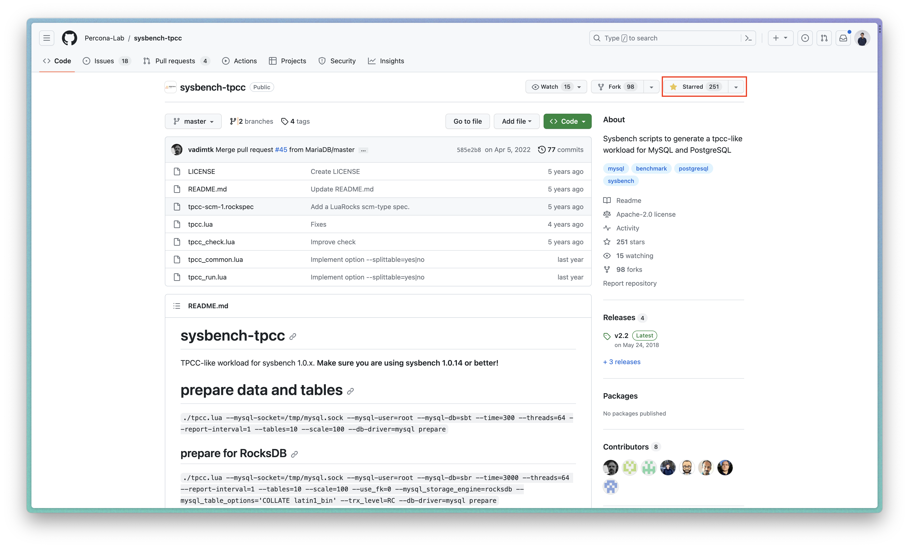

# SQL Exercise

*The [TPC-C specification](https://www.tpc.org/tpcc/default5.asp) was used to generate this exercise, and [Percona-Lab's sysbench-tpcc](https://github.com/Percona-Lab/sysbench-tpcc) source code served as the data generator.*

Instead of concentrating on the building process, we should express our sincere gratitude to individuals who offered up their time and energy to enhance the database system. One way to do this is to award those people with stars.



*What we need to know is how to spin-up the TPC-C database...*

## Getting started

```sh
docker run --name=pg-querying-workshop -p 5432:5432 cloudiana/pg-tpcc:1.0-1X-WITH-INDEX
```

The aforementioned command will construct a database container with the name `pg-querying-workshop`; 
<br />this container requires >= 2GB of disk space.

To stop the database, run the following command:
```sh
docker stop pg-querying-workshop
```

And to start for the next time, use:
```sh
docker start pg-querying-workshop
```