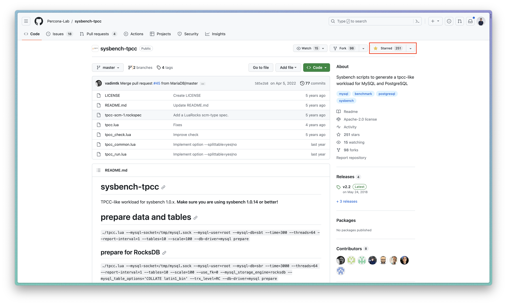

# SQL Fundamental exercises

*The [TPC-C specification](https://www.tpc.org/tpcc/default5.asp) was used to generate this exercise, and [Percona-Lab's sysbench-tpcc](https://github.com/Percona-Lab/sysbench-tpcc) source code served as the data generator.*

Instead of concentrating on the building process, we should express our sincere gratitude to individuals who offered up their time and energy to enhance the database system. One way to do this is to award those people with stars.



*What we need to know is how to spin up the TPC-C database...*

## Getting started

### Database setup

```sh
docker run --name=pg-querying-workshop -p 5432:5432 cloudiana/pg-tpcc:1.1-1X-WITH-INDEX
```

The aforementioned command will construct a database container with the name `pg-querying-workshop`.

The container typically requires at least 2.5 GB of disk space.

To stop the database, run the following command:
```sh
docker stop pg-querying-workshop
```

And for the next time, use:
```sh
docker start pg-querying-workshop
```
to start the database without re-initialization again.

### Codebase setup

First, install all required packages, both dependencies and devDependencies, with the following command:
```sh
npm install
```

Secondly, run the following test command to make sure that everything is in place where it is supposed to be.

```sh
npm run test-sfw-district q0
```

The final result was envisioned to look like this as a solid beginning to our long journey down this path.


## Looking for the next step?

Browse all exercises at [docs folder](docs/exercises.md)